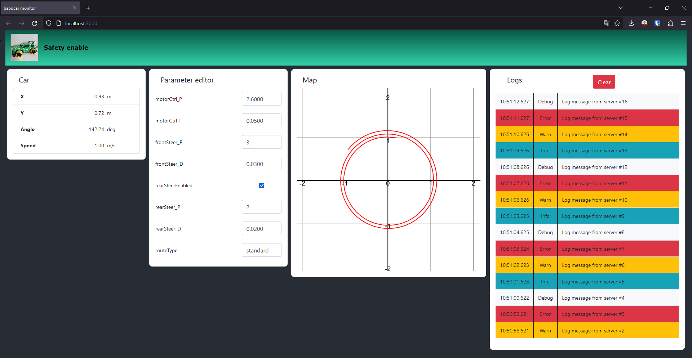

[Node.js](https://nodejs.org/en) test suite for the [babocar](https://github.com/somaveszelovszki/babocar) project.

The test suite is designed to be running as a server on a Raspberry Pi on the car platform.
The server (and all the connected clients) are communicating using topics, to which the clients subscribe.

| Topic         | Description                                                         |
| ------------- | ------------------------------------------------------------------- |
| car           | Car information (position, speed, line control information, etc...) |
| log           | Log messages from the firmware                                      |
| params        | Modifiable firmware parameters                                      |
| update-params | Request to update firmware parameters                               |

# Primary components:

## Server

Generic publish-subscribe manager for the topics sent among the components.

## Serial connector

Connects to the embedded control unit via serial port and propagates messages between the server and the car.

## GUI client

[React](https://react.dev) based web client that visualizes the car information and the logs, and enables the user to modify the car parameters.

# Utility components

## Feed logger

A simple tool for saving the messages of all topics to a file. This file can later be replayed.

## Feed readback

Reads back a previously saved feed to reproduce the events.

## Test connector

Simulates a real moving car. This is a testing tool for the GUI client.

