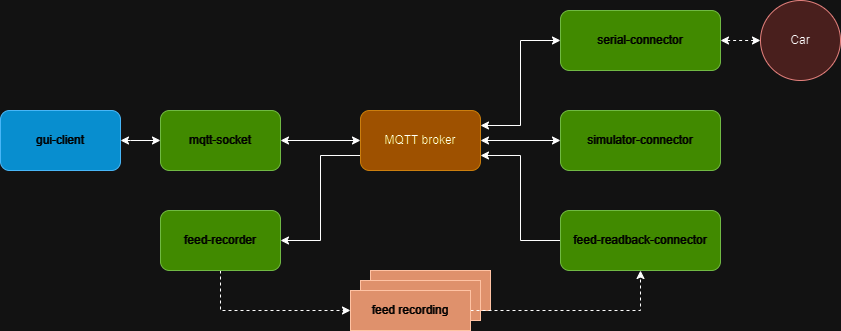

[Node.js](https://nodejs.org/en) test suite for the [babocar](https://github.com/somaveszelovszki/babocar) project.

The test suite is designed to be running on a Raspberry Pi on the car platform.
All the connected nodes are communicating through an MQTT broker using topics, to which the clients subscribe.

| Topic                         | Description                                                         |
| ----------------------------- | ------------------------------------------------------------------- |
| babocar/car                   | Car information (position, speed, line control information, etc...) |
| babocar/log                   | Log messages from the firmware                                      |
| babocar/params                | Modifiable firmware parameters                                      |
| babocar/request-params        | Request parameters                                                  |
| babocar/update-params         | Request to update firmware parameters                               |
| babocar/track-control         | Modifiable track control parameters                                 |
| babocar/request-track-control | Request track control parameters                                    |
| babocar/update-track-control  | Request to update track control parameters                          |

# Running the client

## Before you start

Ensure that an MQTT broker (e.g. [mosquitto](https://mosquitto.org)) is running on localhost.

## Running with a real-time car connection

To run the client using a real-time connection to the car, run the following command:

```
npm start
```

This will start the following nodes: **gui-client, mqtt-socket, serial-connector, feed-recorder**

## Replaying recorded events

To replay recorded events, you need to use the feed-readback-connector instead of the serial-connector.
Recording are located in the **recordings/** folder.
You can run the readback setup like this:

```
npm run readback -- -- --file={PATH_TO_RECORDED_FEED}
```

## Testing with simulated events

For easier testing a helper node has been added to simulate an active car connection. To start the client with this source, run:

```
npm run simulator
```

# Nodes



## Preliminary components:

### MQTT broker

An MQTT broker needs to be running on localhost to distribute the messages sent across the components.

## Primary nodes:

### mqtt-socket

Provides a socket interface for the MQTT broker.

### serial-connector

Connects to the embedded control unit via serial port and propagates messages between the MQTT broker and the car.

### gui-client

[React](https://react.dev) based web client that visualizes the car information and the logs, and enables the user to modify the car parameters.

## Utility nodes

### feed-recorder

A simple tool for saving the MQTT messages of all topics to a file. This file can later be replayed.

### feed-readback-connector

Reads back a previously saved feed and propagates the messages to the MQTT broker.

### simulator-connector

Simulates a real moving car. This is a testing tool for the GUI client.


